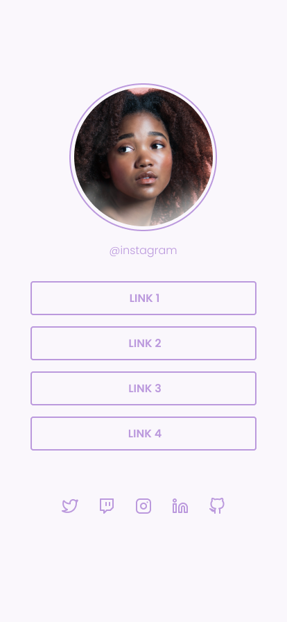
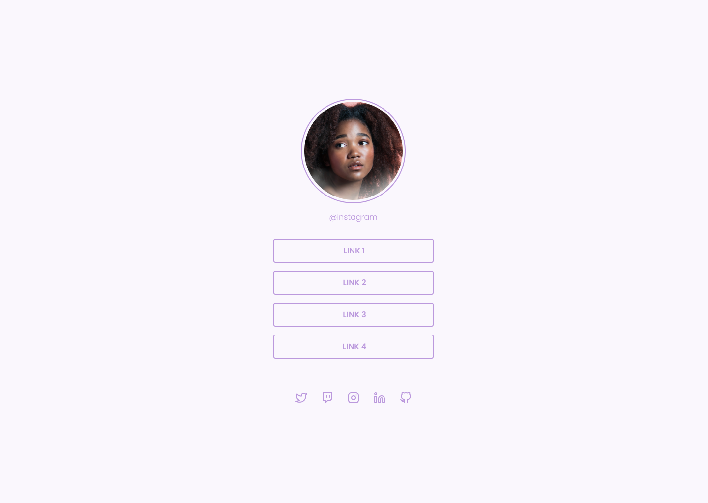

# Desafio: Social Tree

<p align="center">
 
 
 </p>

# 🚀 **Techs**

- HTML
- CSS

# 🎨 Style Guide

## **Cores:**

```css
:root {
  --body-bg-color: #FAF7FD;
  --purple: #BB99DD;
}
```

## **Tipo de fonte:**

font-family: Poppins  <br>
Font Weight: 300 e 600<br>
Você pode encontrar a fonte no [Google Fonts](https://fonts.google.com/) <br><br>
Feito com 💜 por Rocketseat
